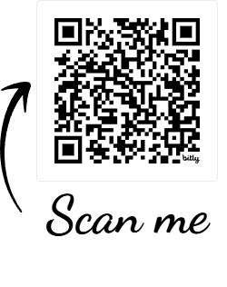

# My Portfolio

This project was created to showcase the projects I have developed and to consolidate my knowledge. Users can navigate through various sections to learn about my skills, projects, and experience. The portfolio also includes an AI-powered chat feature using Gemini to assist users with some questions they may have about me and my projects.

## Tools and Technologies

- **Vite**: A fast build tool and development server for modern web projects.
- **React**: A JavaScript library for building user interfaces.
- **JavaScript**: The programming language used for the development of the project.
- **Tailwind CSS**: A utility-first CSS framework for styling the application.
- **React Icons**: A library for including popular icons in React projects.
- **EmailJS**: A service to send emails directly from the client-side.
- **Chart.js**: A JavaScript library for creating charts.
- **React Chart.js 2**: A React wrapper for Chart.js.
- **React Chatbot Kit**: A library for building chatbots in React.
- **Gemini AI**: An AI model integrated into the chat feature to assist users.
- **Node.js**: A JavaScript runtime for server-side development.
- **Express**: A web application framework for Node.js.
- **ESLint**: A tool for identifying and fixing problems in JavaScript code.
- **Prettier**: A code formatter to ensure consistent code style.
- **Babel**: A JavaScript compiler for using the latest JavaScript features.
- **Webpack**: A module bundler for JavaScript applications.
- **PostCSS**: A tool for transforming CSS with JavaScript plugins.
- **Autoprefixer**: A PostCSS plugin to parse CSS and add vendor prefixes.
- **Jest**: A JavaScript testing framework.
- **React Testing Library**: A library for testing React components.

## Architectures and Patterns

- **Component-Based Architecture**: The application is built using reusable React components.
- **Single Page Application (SPA)**: The project is structured as a single-page application for a seamless user experience.
- **Responsive Design**: The application is designed to be responsive and work well on different screen sizes.
- **API Integration**: The project integrates with various APIs using data fetching.
- **State Management**: State is managed using React's built-in hooks and context API.
- **Modular CSS**: Styling is done using Tailwind CSS for a modular and maintainable approach.
- **Code Quality**: ESLint and Prettier are used to maintain code quality and consistency.

## View the Final Result

To view the final result, click the link or scan the QR code below:

<div align="center">
  <a href="https://portfolio-patrick-bastos.netlify.app/">
    
  </a>
  <br>
  
</div>

## Deployment

The project is deployed using **Netlify**, a platform for automating modern web projects. Netlify provides continuous deployment, a global CDN, and one-click HTTPS.

To deploy the project on Netlify:

1. Create a Netlify account at [Netlify](https://www.netlify.com/).
2. Connect your GitHub repository to Netlify.
3. Configure the build settings:
   - Build command: `npm run build`
   - Publish directory: `dist`
4. Click "Deploy" to start the deployment process.

## Fork and Installation

To fork and install this project, follow these steps:

1. **Fork the Repository**:
   - Go to the GitHub repository page.
   - Click the "Fork" button in the top-right corner of the page.

2. **Clone the Repository**:
   - Open your terminal or command prompt.
   - Run the following command to clone the repository to your local machine:
     ```bash
     git clone https://github.com/your-username/my-portfolio.git
     ```
   - Replace `your-username` with your GitHub username.

3. **Navigate to the Project Directory**:
   - Change to the project directory using the following command:
     ```bash
     cd my-portfolio
     ```

4. **Install Dependencies**:
   - Run the following command to install the project dependencies:
     ```bash
     npm install
     ```

5. **Start the Development Server**:
   - Run the following command to start the development server:
     ```bash
     npm run dev
     ```
   - Open your browser and navigate to `http://localhost:3000` to view the project.

## Color Palette

"High technology: Technology companies often opt for the use of blue, which symbolizes trust, intelligence, and efficiency." - Wix Blog - [How to Choose Your Brand Colors](https://pt.wix.com/blog/2020/02/como-escolher-as-cores-da-sua-marca)

### Author

---

<a href="https://github.com/PatrickBastosDeveloper">
 
 <br />
 <sub><b>Patrick Bastos</b></sub></a> <a href="https://github.com/PatrickBastosDeveloper" title="my-portfolio">🚀</a>

Made by Patrick Bastos
👋🏽 Get in touch!

[]()
[](https://www.linkedin.com/in/patrickbastosdeveloper/)
[](https://mail.google.com/mail/u/0/?tab=rm&ogbl#inbox)